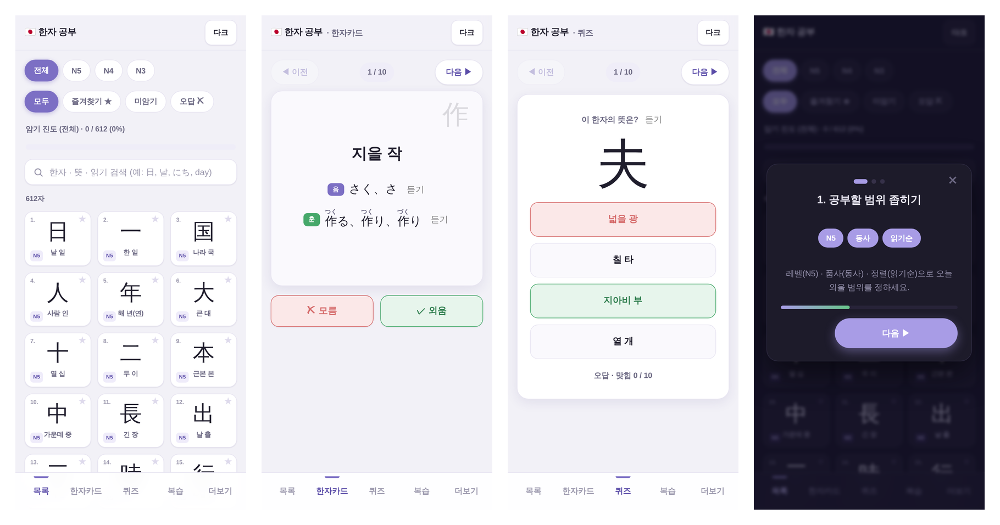

# 🛠️ Vibe to Product

**아이디어를 빠르게 실제 제품으로 만들어가는 바이브코딩 포트폴리오입니다.**

작은 아이디어를 직접 만들고, 출시하고, 기록합니다.

---

## 👋 About

안녕하세요, **[수정 필요: 이름/닉네임]** 입니다.
저는 **[수정 필요: 한 줄 소개 — 예: 일상의 불편함을 작은 웹앱으로 해결하는 것을 좋아합니다]**.

- 🧩 만드는 것: **[수정 필요: 예: 웹앱 · 자동화 도구 · AI 사이드 프로젝트]**
- 🧰 주로 쓰는 기술: **[수정 필요: 예: React, TypeScript, Next.js, Python]**
- 📄 이력서 / 자기소개: **[프로필 보기](https://github.com/easyseop)**
- 📋 전체 진행 상황: **[GitHub Projects 보드](https://github.com/easyseop?tab=projects)**

**상태 표기:** 💡 아이디어 · 🚧 제작 중 · 🧪 테스트 중 · ✅ 완료

> 아래 프로젝트 영역은 [`projects.json`](./projects.json) 으로부터 자동 생성됩니다. **직접 수정하지 마세요.** `projects.json`만 고치면 됩니다.

---

<!-- PROJECTS:START -->

## 🚧 진행 중인 프로젝트

_아직 없습니다._

---

## ✅ 완료한 프로젝트

<table>
<tr>

<td width="50%" valign="top">

### ✅ Kanji JLPT Study

**한 줄 설명**
빌드 없이 index.html 하나로 바로 쓰는 JLPT(N5·N4·N3) 한자 612자 학습 웹앱.

**해결하는 문제 / 주요 기능**
- 레벨·북마크·암기 진도별 필터 + 한자/뜻/음훈/영어 검색
- 상세 보기, 플래시카드, 4지선다 퀴즈 학습 모드
- TTS 음성 읽기, 다크 모드, 획순(KanjiVG) 표시
- PWA 설치 + 오프라인 지원, 진도 자동 저장

**사용 기술**
`HTML` `JavaScript` `Python` `PWA`

**상태:** ✅ 완료

[🔗 데모](https://easyseop.github.io/Kanji-jlpt-study/) · [💻 GitHub](https://github.com/easyseop/Kanji-jlpt-study)

</td>

</tr>
</table>

---

## 💡 앞으로 만들 프로젝트 / 아이디어

_아직 없습니다._

> 아이디어가 구체화되면 `projects.json`의 status를 `building`으로 바꾸세요. 자동으로 카드 섹션으로 이동합니다.

<!-- PROJECTS:END -->

---

## 📫 Contact

- GitHub: [@easyseop](https://github.com/easyseop)
- Email: **[수정 필요: 이메일]**
- 기타: **[수정 필요: 블로그 / X / LinkedIn 등]**

---

이 포트폴리오는 계속 업데이트됩니다 · Made with vibe ✨

